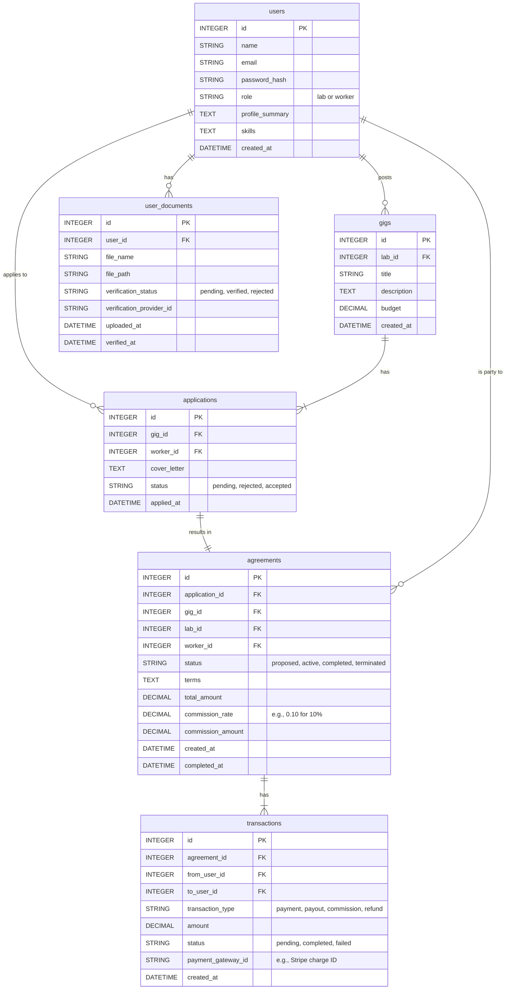

# LabLeap v9: Production Architecture Plan

**Author:** Roo, Architect
**Date:** 2025-07-04
**Status:** DRAFT

## 1. Overview

This document outlines the production architecture of the LabLeap platform, which has been successfully transitioned from its MVP state to a scalable, secure, and feature-rich application. The technical foundation is established to support long-term growth, monetization, and user trust.

This plan addresses four key pillars:
*   **Database Schema:** Evolving from the temporary MVP schema to a robust, relational model.
*   **API Design:** Defining a full-featured, RESTful API for all platform functionalities.
*   **Scalability & Performance:** Choosing production-grade technologies and outlining a strategy for growth.
*   **Security & Compliance:** Implementing measures to protect user data and integrate trusted third-party services.

---

## 2. Production Database Schema

The MVP's reliance on a `status` field within the `applications` table was a necessary simplification for the beta. For production, we will introduce dedicated tables to manage agreements, transactions, and payments, providing a clear and scalable data model.

The platform has been migrated from SQLite to **PostgreSQL** for its robustness, support for complex transactions, and advanced features that are critical for financial reporting and data integrity.

### 2.1. Entity-Relationship Diagram (ERD)

### 2.2. Table Definitions

*   **`agreements`**: This new table is the cornerstone of the production architecture. It replaces the temporary `status` field in `applications` and formally represents the contractual relationship between a Lab and a Scientist.
    *   It links directly to the `application` that initiated it.
    *   It stores the financial terms, including the `commission_rate` that will drive the platform's monetization strategy.
*   **`transactions`**: This table will track all financial movements within the platform.
    *   Every payment from a lab, payout to a scientist, and commission fee collected by LabLeap will be recorded here.
    *   It includes a `payment_gateway_id` to link to external payment processors like Stripe.
*   **`user_documents`**: This table is updated to include fields for `verification_status` and `verification_provider_id` to support the integration of a third-party credential verification service.

---

## 3. Production API Design

The API will be expanded to include new endpoints for managing the lifecycle of agreements and financial transactions.

### 3.1. Agreement Endpoints

*   **`POST /api/agreements`**
    *   **Description:** Creates a new agreement based on an accepted application. This is triggered by a Lab.
    *   **Request Body:** `{ "applicationId": 123, "terms": "...", "totalAmount": 5000.00 }`
    *   **Response:** The newly created agreement object.
*   **`GET /api/agreements/:id`**
    *   **Description:** Retrieves the details of a specific agreement. Accessible to the Lab, Scientist, and Admins involved.
*   **`PUT /api/agreements/:id/status`**
    *   **Description:** Updates the status of an agreement (e.g., from `proposed` to `active` when a scientist accepts).
    *   **Request Body:** `{ "status": "active" }`

### 3.2. Transaction & Payment Endpoints

*   **`POST /api/transactions/payment`**
    *   **Description:** Initiates a payment from a Lab for an agreement. This will integrate with a payment gateway (e.g., Stripe).
    *   **Request Body:** `{ "agreementId": 456, "paymentMethodId": "stripe_payment_method_id" }`
*   **`GET /api/transactions`**
    *   **Description:** Retrieves a list of transactions for the authenticated user.
*   **`POST /api/payouts`**
    *   **Description:** Initiates a payout to a Scientist for a completed agreement, minus the platform commission.

---

## 4. Scalability & Performance

To handle a growing user base and increasing transaction volume, we will adopt the following strategy:

*   **Database:** As mentioned, we will use **PostgreSQL**, hosted on a managed service like **Amazon RDS or Google Cloud SQL**. This provides automated backups, scaling, and maintenance, allowing the engineering team to focus on application development.
*   **Application Hosting:** The Node.js backend will be containerized using **Docker** and deployed on a scalable hosting platform like **AWS Elastic Beanstalk, Heroku, or Google App Engine**. This will allow for easy horizontal scaling by adding more application instances as traffic grows.
*   **Connection Pooling:** We will implement database connection pooling in the Node.js application to manage database connections efficiently and prevent performance bottlenecks under load.
*   **Caching:** We will introduce a caching layer (e.g., **Redis**) to store frequently accessed data, such as user profiles and gig details, reducing database load and improving API response times.

---

## 5. Security & Compliance

Building user trust is paramount. The following security measures will be implemented:

*   **Credential Verification:**
    *   We will integrate with a third-party identity and credential verification service, such as **Persona**, **Veriff**, or **Certn**.
    *   The process will be as follows:
        1.  A user uploads a document via the frontend.
        2.  The backend sends the document to the verification provider's API.
        3.  We will implement a webhook endpoint (`POST /api/webhooks/verification-update`) to receive status updates from the provider.
        4.  Upon receiving a `verified` or `rejected` status, we will update the `verification_status` in our `user_documents` table and notify the user.
*   **Authentication & Authorization:**
    *   Continue using JWT for stateless authentication.
    *   Implement strict, role-based access control (RBAC) middleware on all sensitive endpoints to ensure users can only access data they are authorized to view.
*   **Data Protection:**
    *   All data will be encrypted in transit (TLS/SSL) and at rest (database-level encryption).
    *   Sensitive user data will be handled in accordance with privacy regulations (e.g., GDPR, CCPA).
*   **Payment Security:**
    *   We will delegate all payment processing to a PCI-compliant provider like **Stripe**. Our backend will never store raw credit card information, only the provider's reference tokens.