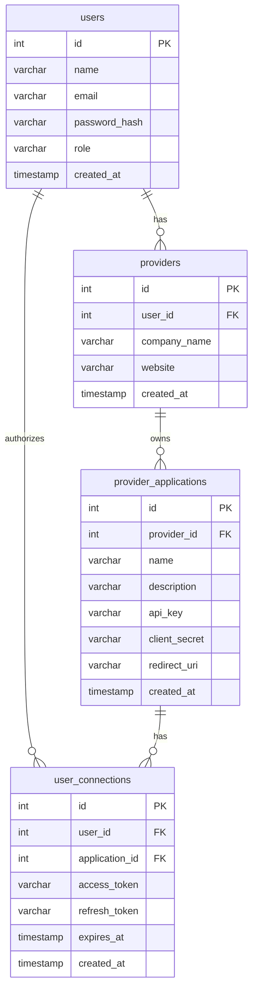
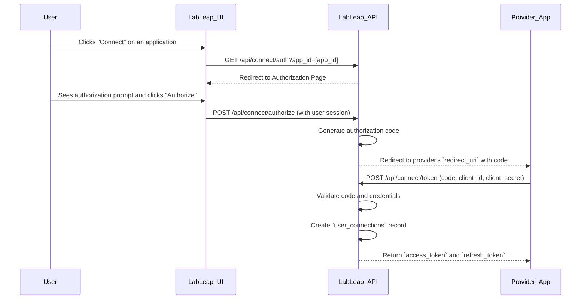

# BioShift Connect - Provider Platform Architecture

## 1. Overview

This document outlines the architecture for the BioShift Connect Provider Platform, a system that allows third-party developers (Providers) to build and integrate their applications with the LabLeap ecosystem. This platform will manage provider registration, application management, and the user authorization flow.

## 2. The "Provider" User Role

A new user role, `Provider`, will be introduced to the system. This role is distinct from the existing `Lab` and `Worker` roles and will have a specific set of permissions tailored to application management.

### 2.1. Role Definition
- **Role Name:** `Provider`
- **Description:** A user account representing a third-party developer or company that creates and manages applications on the BioShift Connect platform.

### 2.2. Permissions
- **Authentication:** Providers will have their own login and registration flow.
- **Application Management:**
    - Create, read, update, and delete their own applications (`provider_applications`).
    - View connection data for their applications (`user_connections`).
    - Manage API keys, OAuth credentials, and webhook endpoints for their applications.
- **Dashboard:** Access to a dedicated Provider Dashboard to view application analytics, user connection counts, and API usage statistics.

## 3. Database Schema

Three new tables will be added to the database to support the Provider Platform.

### 3.1. Database Diagram

### 3.2. Table Definitions

#### `providers`
Stores information about the Provider entities. Each provider is linked to a `users` account.

| Column | Type | Description |
| --- | --- | --- |
| `id` | `SERIAL` | **Primary Key** |
| `user_id` | `INTEGER` | **Foreign Key** to `users.id` |
| `company_name` | `VARCHAR(255)` | The official name of the provider company. |
| `website` | `VARCHAR(255)` | The provider's official website. |
| `created_at` | `TIMESTAMP` | Timestamp of when the provider was created. |

---

#### `provider_applications`
Stores information about each application registered by a Provider.

| Column | Type | Description |
| --- | --- | --- |
| `id` | `SERIAL` | **Primary Key** |
| `provider_id` | `INTEGER` | **Foreign Key** to `providers.id` |
| `name` | `VARCHAR(255)` | The name of the application. |
| `description` | `TEXT` | A short description of the application's functionality. |
| `api_key` | `VARCHAR(255)` | **Unique** key for server-to-server API access. |
| `client_secret` | `VARCHAR(255)` | **Unique** secret for the OAuth flow. |
| `redirect_uri` | `VARCHAR(255)` | The callback URL for the OAuth flow. |
| `created_at` | `TIMESTAMP` | Timestamp of when the application was created. |

---

#### `user_connections`
Links a LabLeap user to a provider application they have authorized.

| Column | Type | Description |
| --- | --- | --- |
| `id` | `SERIAL` | **Primary Key** |
| `user_id` | `INTEGER` | **Foreign Key** to `users.id` |
| `application_id` | `INTEGER` | **Foreign Key** to `provider_applications.id` |
| `access_token` | `VARCHAR(255)` | The token used to access the user's data. |
| `refresh_token` | `VARCHAR(255)` | The token used to refresh the `access_token`. |
| `expires_at` | `TIMESTAMP` | The expiration date of the `access_token`. |
| `created_at` | `TIMESTAMP` | Timestamp of when the connection was established. |

## 4. API Design

The following RESTful API endpoints will be created to manage the Provider Platform. All routes will be prefixed with `/api/provider`.

### 4.1. Provider Authentication
- **`POST /api/provider/register`**: Creates a new `Provider` user account.
- **`POST /api/provider/login`**: Authenticates a `Provider` and returns a JWT.

### 4.2. Application Management (CRUD)
*Requires `Provider` authentication.*
- **`POST /api/provider/applications`**: Create a new application.
- **`GET /api/provider/applications`**: Get a list of applications for the authenticated provider.
- **`GET /api/provider/applications/:id`**: Get details for a specific application.
- **`PUT /api/provider/applications/:id`**: Update an application's details.
- **`DELETE /api/provider/applications/:id`**: Delete an application.

### 4.3. User Connection Flow (OAuth-style)

This flow allows a LabLeap user to authorize a provider's application to access their data.

#### 4.3.1. Connection API Endpoints
- **`GET /api/connect/auth`**: Initiates the connection flow. Requires a logged-in user.
- **`POST /api/connect/authorize`**: The user grants permission.
- **`POST /api/connect/token`**: The provider application exchanges an authorization code for an access token.
- **`POST /api/connect/refresh`**: The provider application uses a refresh token to get a new access token.